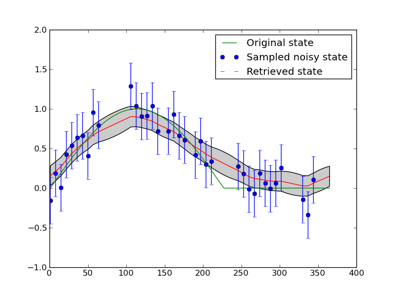
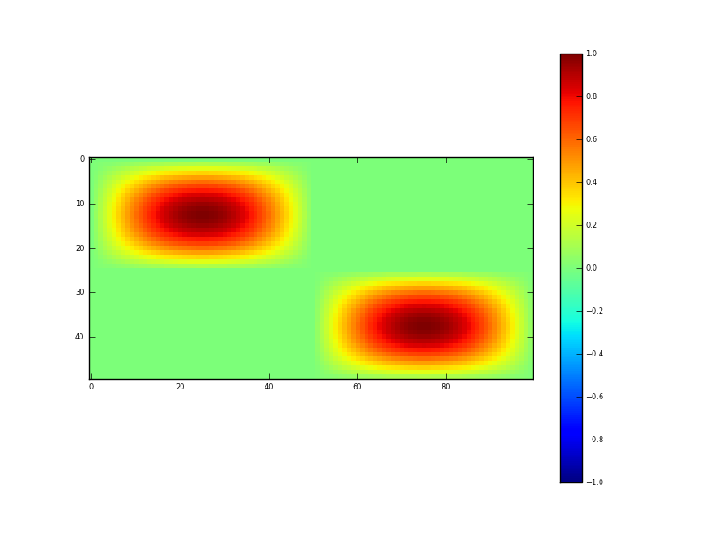
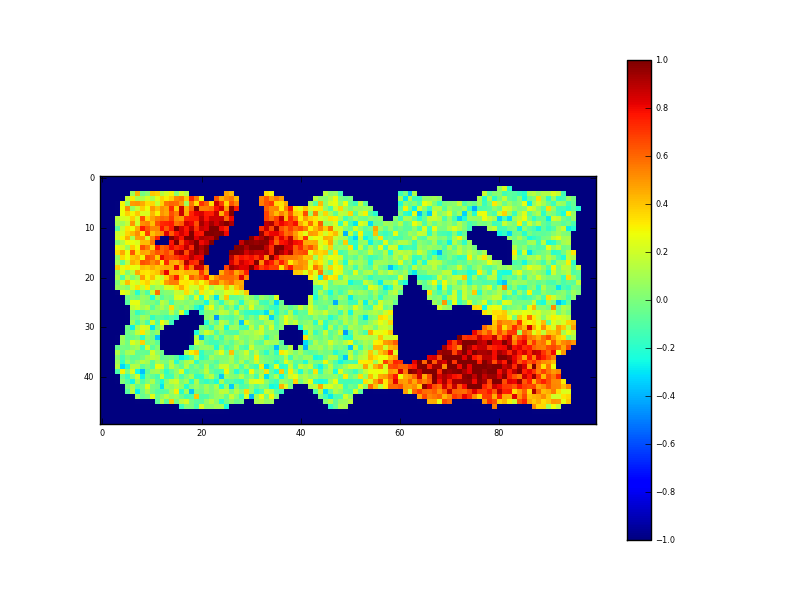
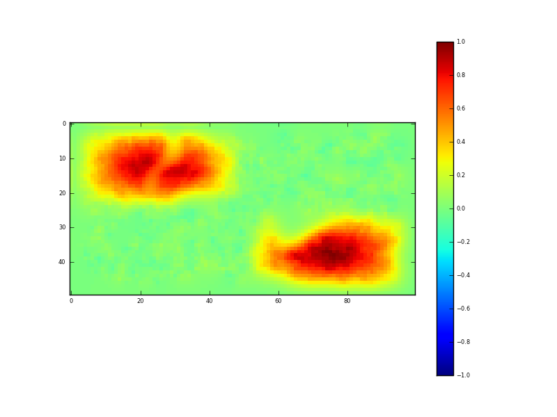
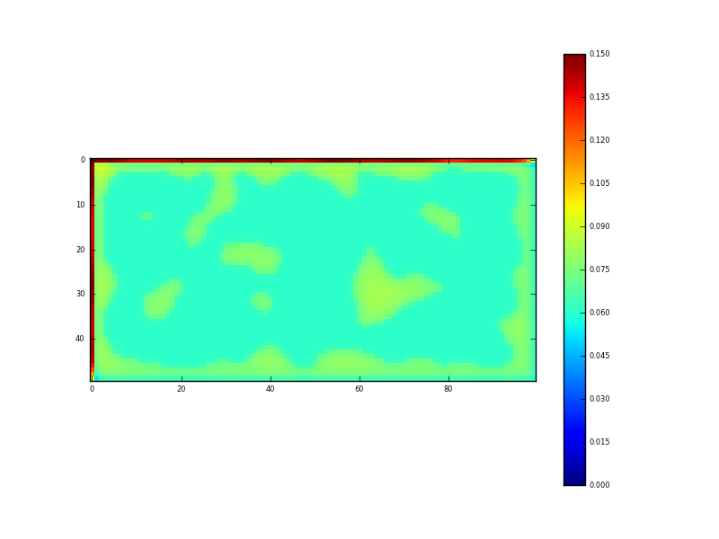
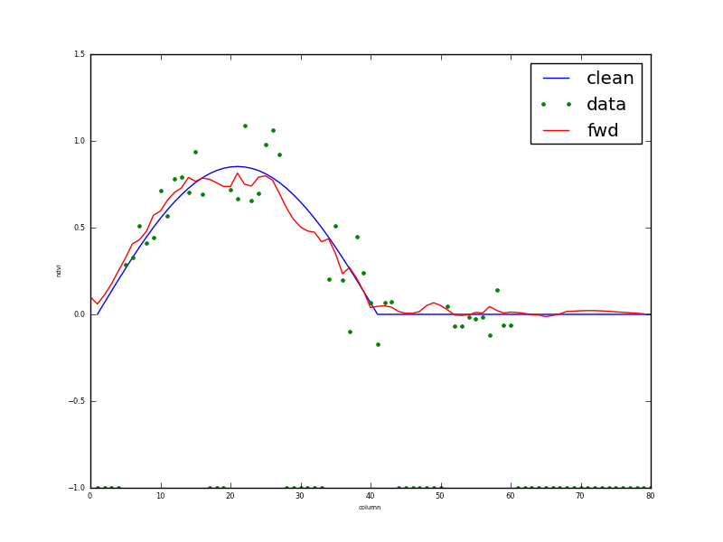
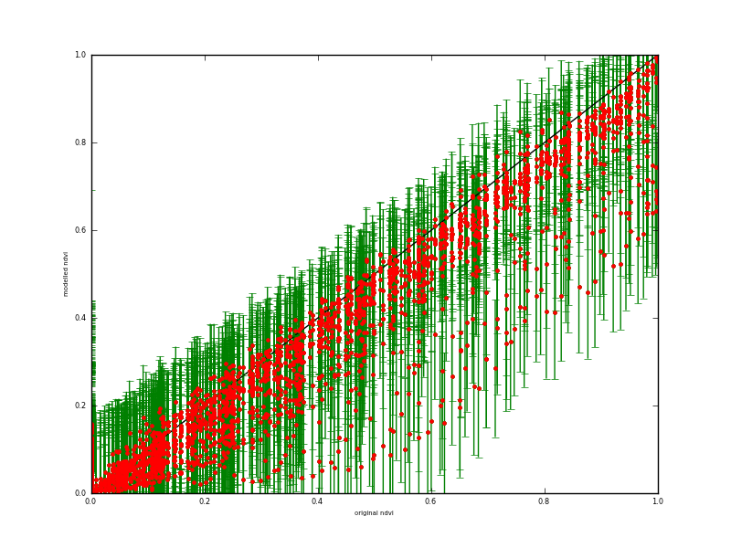

**********************************************************************
Spatial and multi-scale data assimilation examples
**********************************************************************

Introduction
========================

Although  only temporal data assimilation (DA)  has been explored in depth in the 
prototype EO-LDAS tool, it was noted in Lewis et al. (2012a,b) that the tool should 
be capable of spatial, as well as temporal DA. The purpose of this technical note is to 
demonstrate the spatial capabilities of the tool and to show how multi-(spatial) 
resolution DA can be achieved.

To illustrate these concepts, we develop from the regularisation of NDVI data 
example in the EO-LDAS tutorial (www1).  In this example, we demonstrate the 
concept of using regularisation (by a zero-order process model) to  smooth and 
interpolate a noisy data sequence (that we suppose to be NDVI). The data in the 
experiment are synthetic, i.e. generated from a known truth.
The experiment is run from a python code  (www2) that generates the synthetic 
dataset, adds a significant amount of noise (standard deviation 0.15). Correlated gaps 
(mimicking clouds) are introduced into the data. In the example given 33% of the 
observations are removed. The results are shown in the figure below.                                                        

   Fig 1: Smoothing a noisy time series with temporal DA.

The blue dots show the input data, with associated uncertainty (1.95 sigma, i.e. the 
95% confidence interval (C.I)). The ‘truth’ a half sine wave with a flat section is 
shown as the green line. The retrieved state is shown as the red line (mean) and grey 
bounds (95% C.I.). This is a suitable example to demonstrate the principles of 
temporal data assimilation with two constraints: (i) the noisy observations; and (ii) a 
simple (zero-order process model). Although some problems are encountered at 
sudden changes (the transition between the sine wave and the flat time), the form of 
the underlying function is well reconstructed from the noisy samples. In this case, the 
observation operator, i.e. the operator that translates between the space of the state we 
are trying to estimate here (NDVI) and the observations (NDVI) is an identity 
operator. This is chosen to make a fast experiment and to demonstrate principles.
There is no attempt to optimise the ‘smoothness’ (gamma) term in this and following 
experiments. Instead, we take a theoretical value from the truth and reduce it by a 
factor of 5 (so we should generally be under-smoothing).

The EO-LDAS tool is accessed in this example through (i) a configuration file; (ii) a 
command-line to override some of the settings in a generic configuration file. The 
command line is set as:                                                     

[CODE]

and the (generic) configuration file given in www3. In the configuration file, we 
declare the ‘location’ specification to be ‘time’ and specify the parameters we wish to 
solve for (NDVI here).

[CODE]

and set up the differential operator (in time):
    
        [CODE]
        
and the (Identity) observation operator:
    [CODE]
    
In further examples in the tutorial and in Lewis et al. (2012a,b) we go on to show how 
more complex observation operators (such as a radiative transfer model) can be used 
in the DA so that vegetation state variables (LAI etc.) can be estimated from remote 
reflectance observations. The principle of the underlying (zero- or first-order) process 
models is the same as in the simple NDVI example.

The example is also interesting in its own right, as a demonstration of optimal 
filtering, i.e. smoothing with a target, multi-constraint cost function. It also shows 
how uncertainty can be calculated in such an optimal estimation framework.                                                      

Spatial data assimilation
=============================

Spatial data assimilation proceeds in exactly the same way as temporal DA when we 
use these simple process models. In fact, instead of considering the x-axis in figure 1 
as time, we could simply state that it is a transect in space and all of the same results 
and conclusions would apply. In the spatial sense, we might consider this to be quite 
similar to what is done in optimal spatial interpolation schemes such as kriging or 
regression kriging (where some low order model is fitted and the difference constraint 
operates on the residuals of that model) (www4).

Python code for performing a spatial DA is given in www5. It is very much based on 
that for the temporal DA discussed above, but now we generate a synthetic dataset in 
two dimensions:

    
    Fig. 2: Synthetic 2D (spatial) dataset

Figure 2 shows the spatial dataset generated in this code. It contains some 2-D sine 
waves and flat areas. The test data lies between the values 0 and 1 and represents 
NDVI, which one could imagine as representing say 4 ‘fields’ here, two with crops in 
and two bare soil. In such an imagining, we can see spatial variation in the NDVI 
(vegetation density) within the fields.
Noise, of sigma 0.15 is added to these data, and again 33% of the samples removed. 
The input dataset then is shown in figure 3.

   Fig. 3: Sampled synthetic 2D (spatial) dataset

We can again suppose the ‘holes’ in the observations to be representative of clouds.
The configuration file for this experiment is given in www6.
In setting up a spatial DA in EO-LDAS, we declare the location to be ‘row’ and ‘col’:
    
    [CODE]
    
We then define two differential operators, one in row and the other in column space:
    
        
            [CODE]
    
The observation operator is as in the previous example.
The result of running the DA is an estimate of the NDVI for all sample locations:
    

    Fig. 4: Result of DA (mean)
    

which is our posterior estimate of NDVI obtained from the samples given in figure 3. 
It is our ‘optimal estimate’ of the original data (figure 2) and does a very reasonable 
job of this. The uncertainty in this estimate is given by:                                                      

    Fig. 5: Result of DA (sd)
    

Recall that the uncertainty in the input data was 0.15. Where we have sampled data, 
this has been reduced (by the DA/regularisation) to around 0.06, and in the gaps (i.e. 
under the clouds) the uncertainty is around 0.075. The fidelity of this reconstruction is 
perhaps better illustrated by taking a transect through the dataset:
    

    Fig. 6: Transect through dataset at row 13                                                        

The input data are shown as green dots, and the reconstruction given as the red line, 
with cyan (95%) C.I.s. The original data (i.e. what we are trying to reconstruct) is the 
blue line. As with the temporal example in figure 1, this does a remarkably good job.
A scatterplot of the true (x axis) and retrieved (y-axis with 95% CI as green errorbars) 
is shown in figure 7:
    

    Fig. 7: Scatterplot of retrieved (y-axis) against true (x-axis) NDVI over all  spatial samples
    
The scatterplot reveals a slight bias in the retrieved NDVI for high NDVI values, 
which is probably a result of the small number of high values in the input dataset and 
the type of smoothing used). It may just be a feature of the assumption of stationarity 
in the smoothness term. If you compare the high NDVI values in figures 2 and 4 you 
can see this same issue, although it is relatively minor in the grand scheme of things.
Certainly the 95% C.I. covers the extent of the true data, so the C.I. is likely slightly 
over-estimated here.